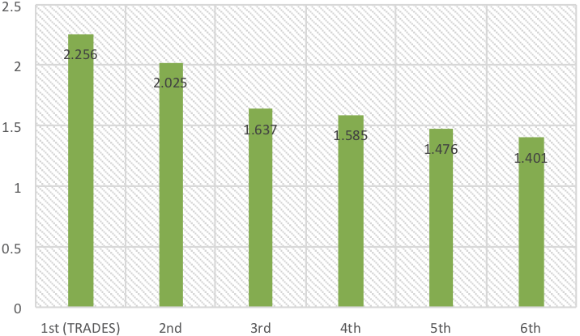

# TRADES (**TR**adeoff-inspired **A**dversarial **DE**fense via **S**urrogate-loss minimization) 

This is the code for the paper "Theoretically Principled Trade-off between Robustness and Accuracy" by Hongyang Zhang (CMU), Yaodong Yu (University of Virginia), Jiantao Jiao (UC Berkeley), Eric P. Xing (CMU & Petuum Inc.), Laurent El Ghaoui (UC Berkeley), and Michael I. Jordan (UC Berkeley).

The code is written in python and requires numpy, matplotlib, torch, torchvision and the tqdm library.

## Install
This code depends on python 3.6, pytorch 0.4.1. We suggest to install the dependencies using Anaconda or Miniconda. Here is an exemplary command:
```
$ wget https://repo.anaconda.com/archive/Anaconda3-5.1.0-Linux-x86_64.sh
$ bash Anaconda3-5.1.0-Linux-x86_64.sh
$ source ~/.bashrc
$ conda install pytorch=0.4.1
```

## Running Demos
### Adversarial Training:

* Train WideResNet-34-10 model on CIFAR10:
```bash
  -  python train_trades_cifar10.py
```

* Train CNN model (two convolutional layers + two fully-connected layers) on MNIST:
```bash
  -  python train_trades_mnist.py
```

* Train CNN model (two convolutional layers + two fully-connected layers) on MNIST (digits '1' and '3') for binary classification problem:
```bash
  -  python train_trades_mnist_binary.py
```

### Robustness Evaluation:

* Evaluate robust WideResNet-34-10 model on CIFAR10 by FGSM-20 attack:
```bash
  -  python pgd_attack_cifar10.py
```

* Evaluate robust CNN model on MNIST by FGSM-40 attack:
```bash
  -  python pgd_attack_mnist.py
```

## TRADES: A New Loss Function for Adversarial Training

### What is TRADES?


### How to import the TRADES loss for your adversarial training?
* To get started, cd into the directory. Put file 'trades.py' to the directory. Then write the following head in your running 'xxx.py' file and replace your loss with TRADES_loss():
```bash
  -  from trades import TRADES_loss
```

## Experimental Results
### Results in the NeurIPS 2018 Adversarial Vision Challenge [[link]](https://www.crowdai.org/challenges/nips-2018-adversarial-vision-challenge-robust-model-track/leaderboards)
TRADES won the 1st place out of 1,995 submissions in the NeurIPS 2018 Adversarial Vision Challenge (Robust Model Track), surpassing the runner-up approach by 11.41% in terms of mean L2 perturbation distance.
<p align="center">
    
</p>


### Results in the Unrestricted Adversarial Examples Challenge [[link]](https://github.com/google/unrestricted-adversarial-examples)

In response to the Unrestricted Adversarial Examples Challenge, we implement TRADES (with extra spatial-transformation-invariant considerations) on the bird-or-bicycle dataset.

All percentages below correspond to the model's accuracy at 80% coverage.

| Defense               | Submitted by  | Clean data | Common corruptions | Spatial grid attack | SPSA attack | Boundary attack |  Submission Date |
| --------------------- | ------------- | ------------| ------------ |--------------- |-------- | ------- | --------------- |
| [Keras ResNet <br>(trained on ImageNet)](examples/undefended_keras_resnet)   |  Google Brain   |    100.0%    |    99.2%    |  92.2%    |     1.6%    |     4.0%     |  Sept 29th, 2018 |
| [Pytorch ResNet <br>(trained on bird-or-bicycle extras)](examples/undefended_pytorch_resnet)  |  Google Brain | 98.8% | 74.6% | 49.5% | 2.5% | 8.0% | Oct 1st, 2018 |
| [Pytorch ResNet50 <br>(trained on bird-or-bicycle extras)](https://github.com/xincoder/google_attack) |TRADES|100.0%|100.0%|99.5%|100.0%|95.0%|Jan 17th, 2019 (EST)|

## Reference
For technical details and full experimental results, see [the paper]().
```
@article{Zhang2019theoretically, 
	author = {Hongyang Zhang and Yaodong Yu and Jiantao Jiao and Eric P. Xing and Laurent El Ghaoui and Michael I. Jordan}, 
	title = {Theoretically Principled Trade-off between Robustness and Accuracy}, 
	journal={},
	year = {2019}
}
```

## Contact
Please contact yy8ms@virginia.edu and hongyanz@cs.cmu.edu if you have any question on the codes.
